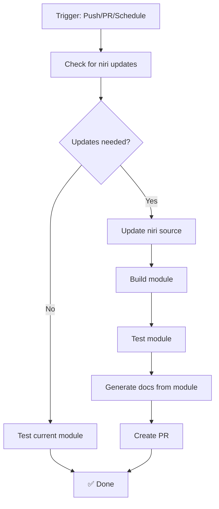

# Workflow Simplification

## Problem with Previous Workflows

The previous workflow setup had several issues:

1. **Multiple workflows** generating the same content 4 times:
   - `update-niri-module.yml`
   - `module-test.yml`
   - `docs.yml`
   - `check.yml`

2. **Path access issues** in pure evaluation mode:
   ```bash
   # This fails in pure evaluation:
   import ./module/niri.nix
   # Error: access to absolute path is forbidden in pure evaluation mode
   ```

3. **Complex test matrices** that duplicated effort and made debugging harder

4. **Separate documentation generation** instead of generating docs from the module

## New Unified Approach

### Single Workflow: `unified.yml`

The new approach uses a **single workflow** that:

1. **Checks for niri updates** (once)
2. **Builds the module** (once)
3. **Generates docs from the module** (not separately)
4. **Tests everything together** (simpler)
5. **Creates PRs only when needed** (less noise)

### Key Improvements

#### 1. **Pure Evaluation Compatible**
```bash
# Instead of absolute imports:
# import ./module/niri.nix  ❌

# Use flake outputs:
nix eval .#homeManagerModules.niri  ✅
```

#### 2. **Simple Test Configs**
```nix
# test-config.nix - No complex imports needed
{
  basic-config.programs.niri = {
    enable = true;
    settings = { /* ... */ };
  };
}
```

#### 3. **Unified Build Process**
```bash
# One command builds everything:
nix build .#homeManagerModules.niri
nix build .#packages.x86_64-linux.niri-docs
```

#### 4. **Documentation from Module**
Instead of generating docs separately, docs are generated from the actual module that gets built and tested.

### Workflow Flow



### Benefits

1. **Faster CI** - Single workflow instead of 4
2. **Less complexity** - Unified build and test process
3. **Better debugging** - All steps in one place
4. **Pure evaluation** - No absolute path issues
5. **Consistent docs** - Generated from actual tested module
6. **Fewer PRs** - Only when actual updates are available

### Migration Plan

1. ✅ Create unified workflow
2. ✅ Add simple test configurations
3. ✅ Update flake for better testability
4. 🔄 Test the unified workflow
5. ⏭️ Remove old workflows once confirmed working
6. ⏭️ Update documentation

### Testing the New Workflow

You can test the components locally:

```bash
# Test module evaluation
nix eval .#homeManagerModules.niri --impure

# Test basic config
nix eval --impure -f test-config.nix basic-config.programs.niri.enable

# Test kebab-case validation
nix eval --impure -f test-kebab-actions.nix

# Build everything
nix build .#packages.x86_64-linux.generator
nix build .#packages.x86_64-linux.niri-docs
```

This approach is much simpler and more reliable than the previous 4-workflow setup!